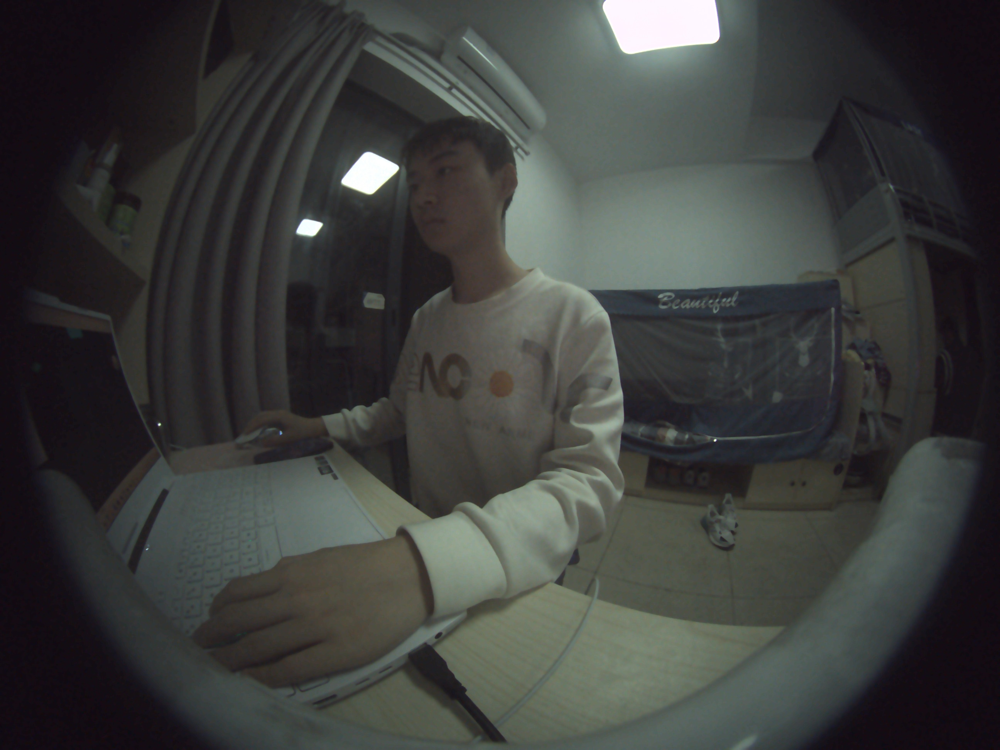
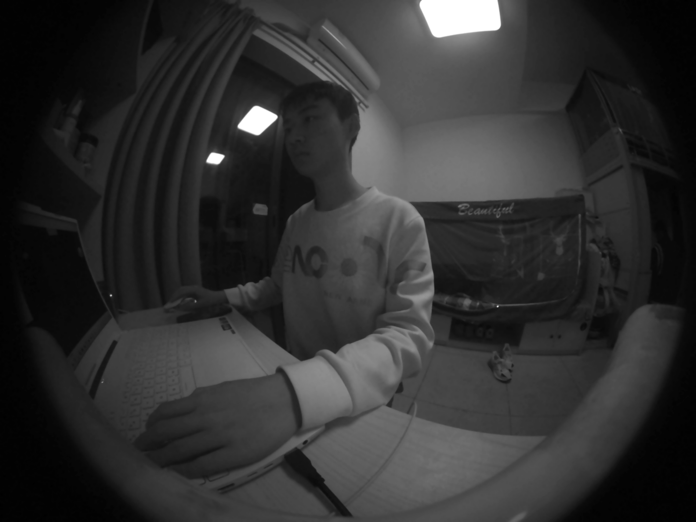
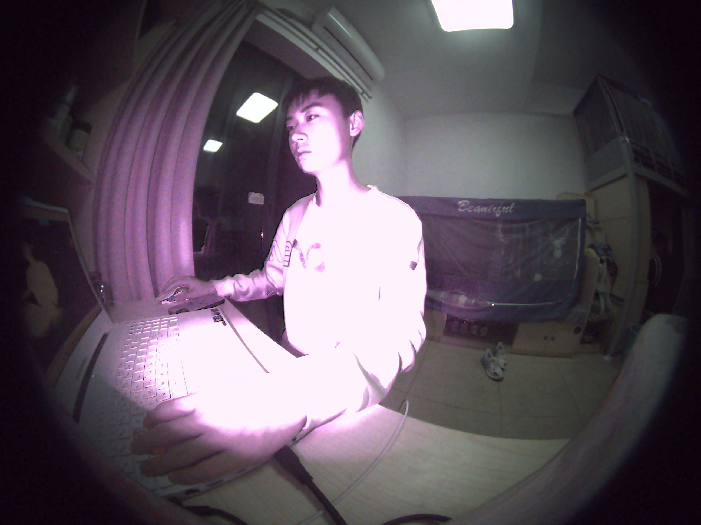
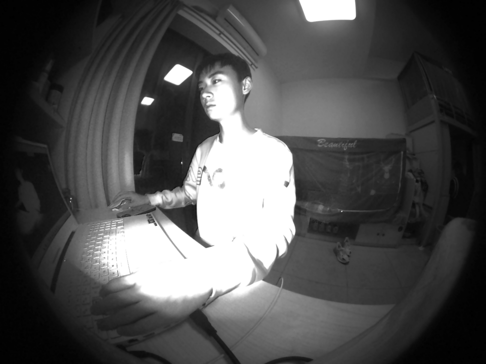
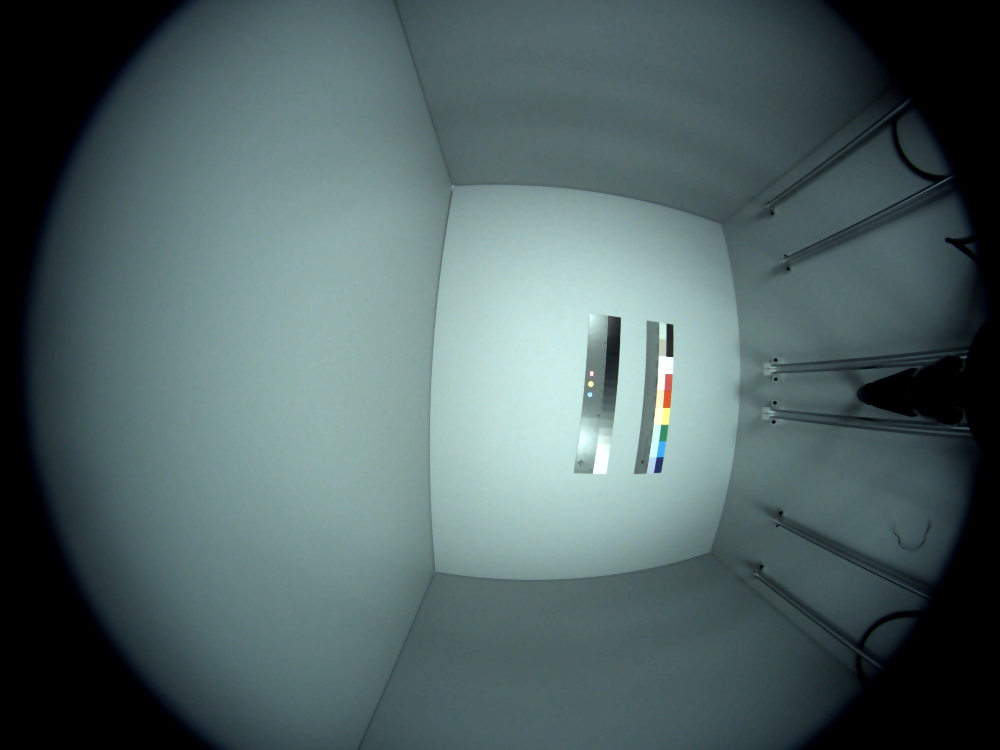
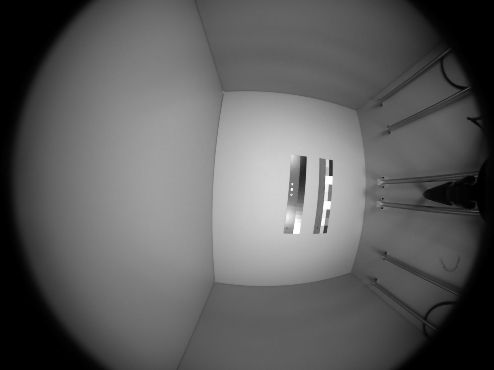
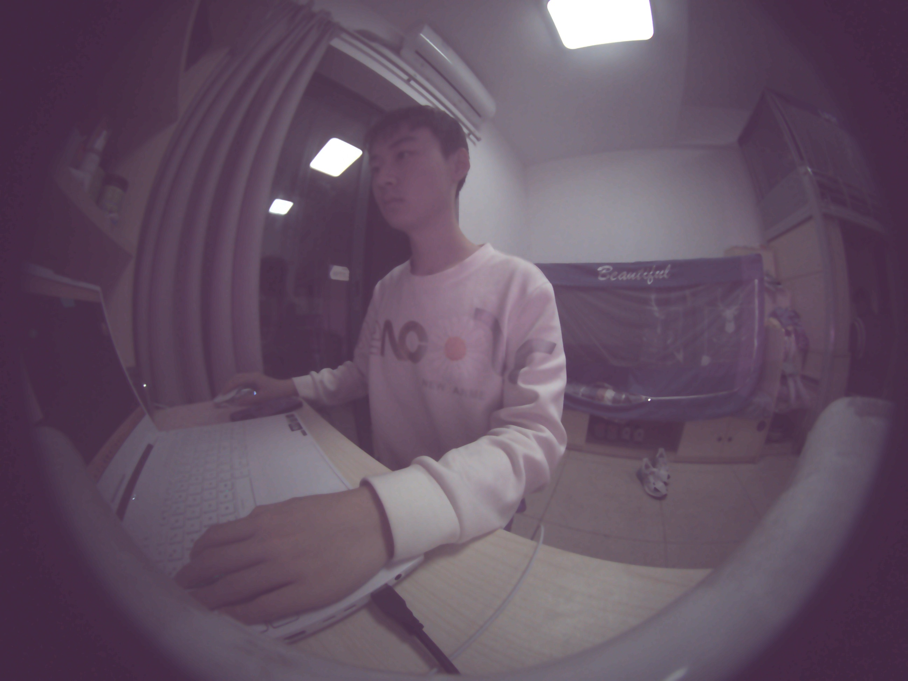
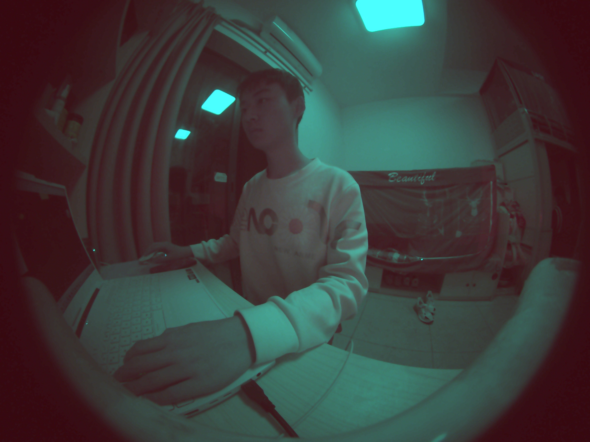
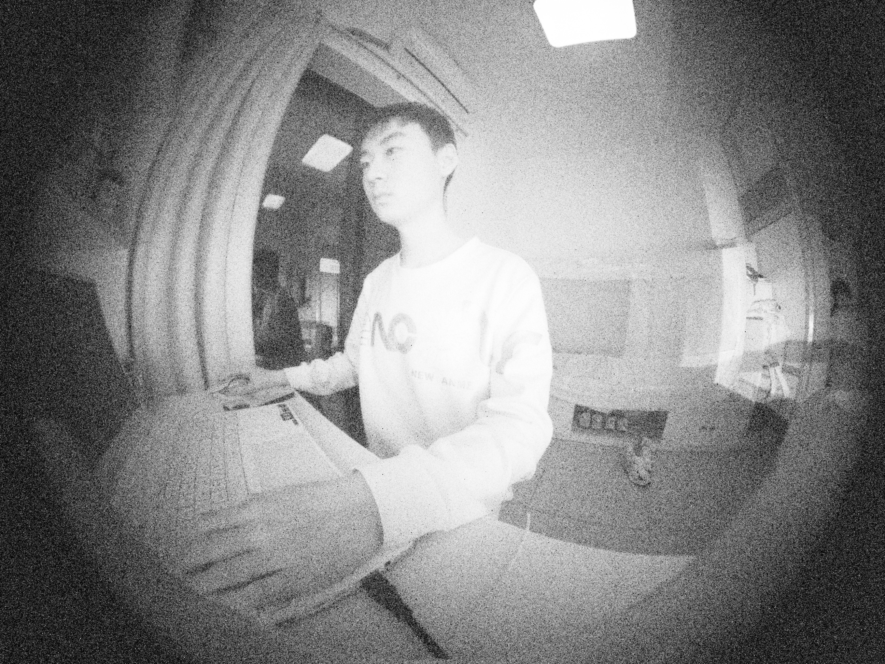
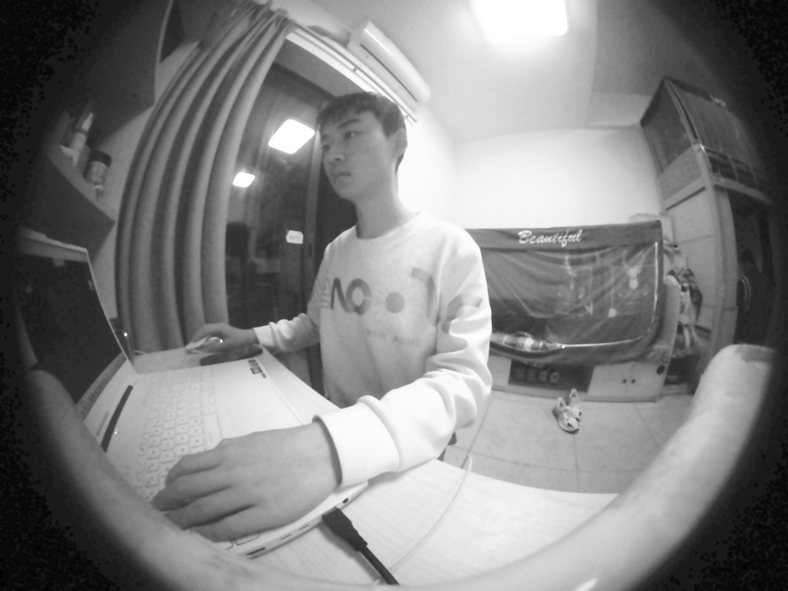

# openRGB-IR Image Signal Processor

openRGB-IR is a **free** and **open source** software image signal processor (ISP) for single sensor RGB-IR cameras such as the OmniVision OV5678 and OnSemi AR0237. It is an extension of the [fast-openISP](https://github.com/QiuJueqin/fast-openISP) project, with modules added to support end-to-end processing of color and infrared images from a single sensor with a RGB-IR color filter array (CFA).


# Usage

Clone this repo and run

```sh
python3 isp.py -s <source_file>
```

You may need to first install the required dependencies with `pip install -r requirements.txt`.

## Arguments

- `-s <source_file>` – **[REQUIRED]** Path to your RAW file

- `-c <config_file>` – **[OPTIONAL]** Path to your config file

- `-o <output_name>` – **[OPTIONAL]** Name of output file, e.g. 'output'

> All outputs will be saved to `./output` directory as `<output_name>.png`. In addition, an infrared 	image `<output_name>_ir.png` will also be saved if the `irc` module is enabled.

## Demo

A demo file is provided to process the two test raws and a D65 chart from the `raw/` directory.

```sh
python3 demo.py
```

Below, the results of the demo with the **quality** config are shown:

|    |    |
| :-------------------------: | :----------------------------: |
|    **Fig 1.1.1 – Dark**     |    **Fig 1.1.2 – Dark IR**     |
|  |  |
|   **Fig 1.2.1 – Bright**    |   **Fig 1.2.2 – Bright IR**    |
|     |     |
|     **Fig 1.3.1 – D65**     |     **Fig 1.3.2 – D65 IR**     |

# Modules

The openRGB-IR pipeline utilises processing algorithms from the fast-openISP project. The processing of color and infrared images from single sensor RGB-IR cameras is facilitated by the addition of IRC, RGBIR, and JBF modules.

### IRC (IR Cut)

The IRC module extracts the value of the IR pixel from each 2x2 kernel and upsamples it to the full resolution of the sensor. The value obtained is then subtracted from the entire sensor region to compensate the spectral overlap between visible and infrared light captured by the color filter array. 

|   |  |
| :---------------------: | :----------------------: |
| **Fig 2.1 – No IR Cut** |   **Fig 2.2 – IR Cut**   |

A better result can be obtained by combining this with a physical band-stop 'notch' filter that cuts off near-IR radiation. We can see that a pure software based implementation of an IR-cut filter in **figure 1.2.1** is less than ideal, as there is not enough dynamic range in the sensor data to preserve the highlight information when it is exposed to a strong IR light source. IR cut attenuation is implemented in order to preserve the appearance of the highlight clipped regions, as they would otherwise look undersampled.

### RGBIR (RGB-IR Color Interpolation)

| **B** | **G**  | **R** | **G**  |
| :---: | :----: | :---: | :----: |
| **G** | **IR** | **G** | **IR** |
| **R** | **G**  | **B** | **G**  |
| **G** | **IR** | **G** | **IR** |

The RGB-IR color filter pattern is contained within a 4x4 kernel as shown in the table above. It contains half the amount of red and blue pixels that a traditional bayer filter pattern contains, which neccesitates a new interpolation algorithm. The simplest solution is to perform nearest neighbour interpolation of the blue and red pixels. However, this would result in increased chroma artifacting. 

The interpolation algorithm implemented in this RGBIR module is a form of pattern-directed interpolation that takes the surrounding pixels in a 3x3 and 5x5 kernel for red and blue interpolation respectively into account to interpolate the missing color values of a traditional bayer pattern.
$$
\text{Oblique}_{red}= \frac{R_{left}+R_{right}}{2} \\\\
\text{Cross}_{blue}=\frac{B_{top}+B_{down}+B_{left}+B_{right}}{4}
$$

From this module, we obtain a BGGR bayer pattern which can be demosaiced by various well-researched methods such as malvar interpolation or adaptive homogenity directed interpolation among others.

|                     |                |
| :---------------------------------------: | :------------------------------------: |
| **Fig 3.1 – Without Color Interpolation** | **Fig 3.2 – With Color Interpolation** |


> Note that the implementation of the RGBIR module is an unoptimised proof of concept that uses a nested for-loop which causes its slow execution speed due to its time complexity of $O(n^2)$. Future revisions can be optimised by refactoring this module to use matrix operations that can bring time complexity down to $O(n)$ time.

### JBF (Joint Bilateral Guided Upsampling Filter)

The JBF module filters the upsampled infrared image to better preserve edge detail. The approach taken in this implementation is to use the gaussian giltered luminance (Y) channel of the final YCbCr image as a guide for the edges to reduce artifacting caused by nearest neighbour upsampling. This allows us to increase the brightness gain without adding too much noise to the image.
$$
\text{Guide}=\text{Gaussian}(Y_\text{Luma})-\text{Upsample}(I_{\text{IR}})\\
\text{Guided Upsample} = \text{Upsample}(I_{\text{IR}})+\text{Guide}
$$

|            |            |
| :------------------------------: | :------------------------------: |
| **Fig 4.1 – Luma gain sans JBF** | **Fig 4.2 – Luma gain with JBF** |

As we can see in the images above, the filtered image is able to be pushed to a higher exposure much more cleanly and with much less noise than the unfiltered image, since it contains additional information from the luminance values of the R, G, and B pixels. 

# Configuration

Two configuration files (`quality.yaml` and `speed.yaml`) with predefined parameters are provided. They are tuned to the characteristics of the provided RAW files. Tunable parameters can be adjusted to suit the individual characteristics of a specific sensor. Their functions should be self explanatory given the comments in the provided sample `.yaml` configuration files.

> Note that some modules are dependent on others. Hence, some pipeline stages cannot be enabled without an earlier stage being enabled as well. Dependencies can be checked at the start of each module class. 


# License

Copyright © 2023 Vincentius Janssen.

Licensed under the [MIT License](http://opensource.org/licenses/MIT).

> Full attribution of works this project is derived from from can be found in the license file.
